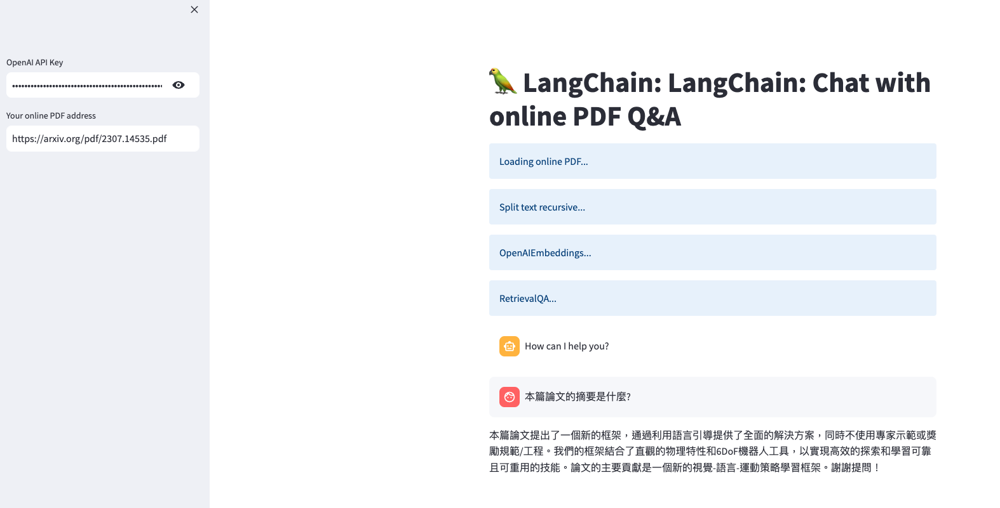

# LangChain: Chat with Online PDF Q&A on Heroku



The purpose of this repository is to provide a Python Streamlit app that interacts with online PDF documents using a QA mechanism. The application leverages various custom modules from the LangChain library, GPT-3 models, and other resources to perform this task.

The main functions of this application are:

1. Load PDF document from a given online link.
2. Split the loaded PDF into manageable parts.
3. Generate embeddings using OpenAI's technology.
4. Implement a QA retrieval chain.
5. Engage in a conversation with the user and generate responses from the application based on the context of the PDF document.

## Deploy

[](https://heroku.com/deploy)

## Setup & Installation

Before you proceed, make sure you have Python 3.7 or higher installed.

1. Clone the repository

    ```
    git clone https://github.com/yourusername/reponame.git
    ```

2. Change directory into the cloned repository

    ```
    cd reponame
    ```

3. Install the necessary dependencies

    ```
    pip install -r requirements.txt
    ```

## How to use

The entry point of the application is the Python file.

To run the application, use the command:

```shell
streamlit run yourpythonfile.py
```

Replace `yourpythonfile.py` with the actual name of your Python file.

Then go to your browser and enter the address that Streamlit gives you, and you should see the LangChain application running.

In the sidebar, you will be asked to enter your OpenAI API Key and the address of your online PDF. After adding these details, the application will be ready to use. You can ask any question, and the application will try to answer it using the context from the PDF document.

## Note

Please note that this script uses the OpenAI's GPT-3 model which is a paid service. You need to have an OpenAI account and the corresponding API key.

## Contributions

Contributions, issues, and feature requests are welcome. Feel free to check [issues page](https://github.com/yourusername/reponame/issues) if you want to contribute.

## License

This project is [MIT](https://choosealicense.com/licenses/mit/) licensed.
